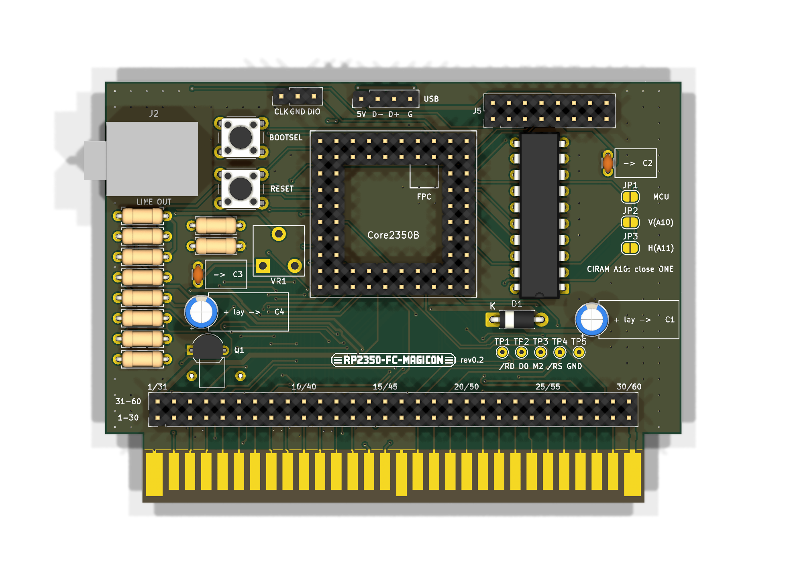
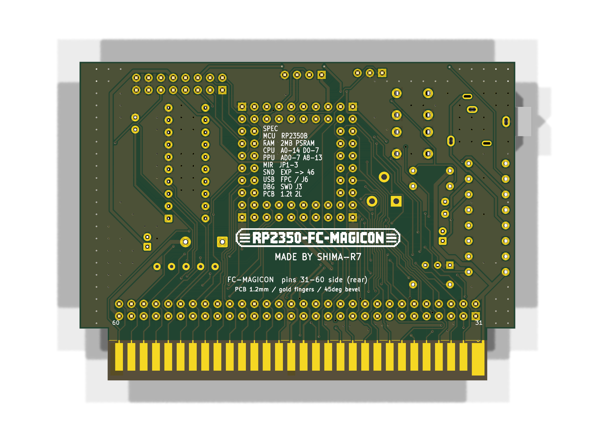
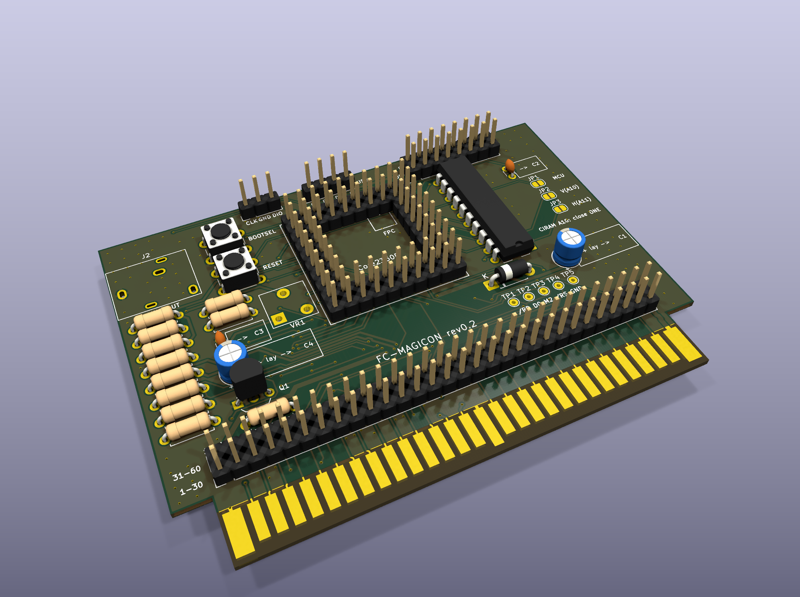

# FC-MAGICON

Waveshare Core2350B(RP2350B)1枚で作るファミコン用カセット。

- PRG・CHR を RP2350B がリアルタイムにエミュレート(マジコン。NROM/CNROM/UNROM/MMC1/MMC3 などをファームで実装)
- NSF 再生(バンク切り替え・WRAM 対応。拡張音源は PWM で46番に混ぜる)
- PC→FC 画面転送(PPU の読み出しに直接応答する FC-PICO 方式)

## 現状(2026-09-26)

- **基板 rev0.2 の設計が完了(2層、DRC エラー0・未接続0)。未発注・未実装。**
- ファームウェア: 動作確認用の `bus_test`(CPU バスでテスト ROM を返して音を鳴らす)と `chr_test`(PPU に CHR を返して画面に格子模様を出す)を作成、ビルド済み。[`firmware/`](firmware/README.md)
- rev0.1 からの変更: USB の予備ランド(J6)、拡張音源の音量用の半固定抵抗 VR1(KOA KVSF637AC104)を追加、
  電源・音声の配線を太くした(+5V 0.8mm、VBUS 0.6mm、GND 0.5mm、+3V3 0.4mm、音声 0.4mm)、J5 の 12〜14番を GND に。
- ガーバー: [`kicad/FC-MAGICON_gerber_r0.2.zip`](kicad/FC-MAGICON_gerber_r0.2.zip)(発注の指定は下の「基板の発注」)
- 仕様書: [`docs/hardware_spec.pdf`](docs/hardware_spec.pdf)(rev0.2)

| 正面(部品面、本体の手前) | 背面 |
|---|---|
|  |  |

## ファイル

| パス | 内容 |
|---|---|
| `kicad/gen_schematic.py` | 回路図の生成スクリプト(`python gen_schematic.py` → `FC-MAGICON.kicad_sch`) |
| `kicad/gen_footprints.py` | カセット端子と半固定抵抗(KOA KVSF637A)のフットプリントを生成 |
| `kicad/build_pcb.py` | 基板の部品配置(`place`)、配線の取り込みと GND ベタ(`import`)、一部の配線のやり直し(`reroute`) |
| `kicad/route.py` | Freerouting で自動配線(線幅のクラスを付ける) |
| `kicad/add_part.py` / `sync_nets.py` / `hand_route.py` | 配線済みの基板に部品を足す / パッドのネットを回路図に合わせる / 1本だけ手で引く |
| `kicad/export_gerbers.ps1` | DRC がエラー 0 のときだけガーバーを出して zip にする |
| `kicad/bom.py`, `print_bom.ps1` | 部品表(`bom.csv`)の作成と印刷 |
| `kicad/print_core2350b_pinmap.ps1`, `print_fit_check.ps1` | Core2350B のピン照合シート、実寸の現物合わせシートの印刷 |
| `kicad/check_nets.py`, `drc_summary.py` | 回路図の簡易チェック、DRC レポートの集計 |
| `3d/` | 基板の STEP(`FC-MAGICON_r0.2_parts.step` 部品あり / `_board.step` 基板だけ / `FC-MAGICON.step` 部品あり版を Autodesk で読み込んで書き出し直したもの)。`make_models.py` → `export_step.py`(KiCad の Python)で作り直す。原点は基板の左上、Y は上向き(基板は Y 0〜-65.8) |
| `kicad/print_part_guide.ps1` | 部品案内図(表・裏、原寸)の印刷 |
| `case/label/` | カセット表面のシール(`make_label.py` → `label.png`、`print_label.ps1` で A4 に印刷)。99 x 60.6mm、ケースの穴(J3/J5/J6/VR1/SW/Core2350B2)は原寸 |
| `case/*.py` | ケースの元データ(下記)の寸法を調べたスクリプトと、基板の部品の占有範囲(`parts.json`) |
| `docs/` | ハードウェア仕様書(`build_spec.py` と `kicad/gen_spec_tables.py` で作る) |

KiCad 10、Freerouting 2.4.1 を使用。KiCad の Python(pcbnew)で実行するスクリプトと、ふつうの Python で実行するスクリプトがある(各ファイルの先頭に記載)。

## ライセンス

MIT(`LICENSE`)。外形の参考にしたデータ(下記「カセット外形の参考データ」)はこのリポジトリに含めていない。

## ピン割り当て

| GPIO | 信号 | カセット端子 | 備考 |
|---|---|---|---|
| 0-7 | CPU D0-D7 | 43,42,41,40,39,38,37,36 | |
| 8-22 | CPU A0-A14 | 13,12,11,10,9,8,7,6,5,4,3,2,33,34,35 | A0から連続 |
| 23 | /ROMSEL | 44 | |
| 24 | CPU R/W | 14 | |
| 25 | M2 | 32 | |
| 26-33 | PPU AD0-AD7 | 26,27,28,29,60,59,58,57 | /RD直前はアドレス下位、その後データ |
| 34-38 | PPU A8-A12 | 51,52,53,54,55 | 26-38で13ビット連続 |
| 39 | (基板上LED) | — | バスに使わない |
| 40 | PPU /RD | 17 | U2(74LVC245)経由 |
| 41 | PPU /WR | 47 | U2経由 |
| 42 | PPU A13 | 56 | U2経由 |
| 43 | CIRAM A10 出力 | 18 | JP1を閉じたとき |
| 44 | 拡張音源 PWM | 46へ混ぜる | |
| 45 | /IRQ 駆動 | 15 | Q1(NPN)でオープンコレクタ |
| 46 | 本体5V検出 | 30,31 を分圧 | Highになるまでバスに出力しない |

- PIO の32本窓: CPU 用ブロックは GPIO0-31、PPU 用ブロックは GPIO16-47。
- GPIO0-38 は 5V トレラント。GPIO40-47 は ADC 兼用で **5V 非トレラント**。
- PPU A0-A7(19-25, 50番)はつながない。
- CIRAM /CE(48)は /A13(49)に直結(R1 0Ω)。
- ミラーリング: JP1(MCU)/ JP2(A10=垂直)/ JP3(A11=水平)のどれか1つだけ閉じる。

## テスト用のランド(2.54mmピッチ、ピンヘッダー・ソケットどちらも可)

基板は規格(56.8mm)より 9mm 高い(90 × 65.8mm)。

**J4: カセット60ピン全部(2x30)** — 差し込み部のすぐ上(2026-09-26、2層に収めるため上辺から移動)
各列がカセット端子の真上にあり、端子から J4 まではほぼ真上への短い配線。上の列 = 31〜60番、下の列 = 1〜30番。
部品面(本体の手前)から見て左端が 1/31番、右端が 30/60番(シルクに列番号あり)。
RP2350 では使わない PPU A0-A7(19〜25番、50番)も出している。

**J5: 基板内部の信号(2x8)** — 上辺
部品面から見て左端が 1/2番。奇数番 = 下の列、偶数番 = 上の列。

| ピン | 信号 | ピン | 信号 |
|---|---|---|---|
| 1 | PPU /RD(3.3V、U2の後) | 2 | PPU /WR(3.3V) |
| 3 | PPU A13(3.3V) | 4 | CIRAM A10(GPIO43の出力) |
| 5 | 拡張音源 PWM(GPIO44) | 6 | PWM の RC フィルタの後 |
| 7 | /IRQ 駆動(GPIO45) | 8 | 本体5V検出(GPIO46) |
| 9 | +3.3V | 10 | VBUS(モジュールの電源) |
| 11 | CIRAM A10(18番へ行く線) | 12 | ライン出力(47kの前) |
| 13 | Q1 ベース | 14 | ライン出力(100Ωの後) |
| 15 | GND | 16 | GND |

TP1〜TP5(/RD、D0、M2、/ROMSEL、GND)はオシロのプローブ用。

## 基板発注前に確認すること

1. ~~**カセット端子の電源・音声・制御ピン。**~~ → 2026-09-26 ユーザーが麻雀カセット・本体で確認、問題なし。 信号線51本はダンパー(`../FC`)で実機確認済み。
   1,16(GND)・30,31(+5V)・15(/IRQ)・18(CIRAM A10)・45,46(音声)・47(/WR)・48(CIRAM /CE)・49(/A13)は
   nesdev の資料によるので、麻雀カセットと本体で導通を確認する。
2. ~~**45/46 の向き。**~~ → 2026-09-26 確認済み。 本体(HVC-CPU-07)で、どちらが 2A03 の音声回路につながっているか確認する。
3. ~~**本体の /IRQ プルアップの有無。**~~ → 2026-09-26 確認済み。 無ければ R6(10k)を実装する。
4. ~~Core2350B のヘッダー配置~~ → 2026-09-26 に照合シート(`kicad/print_core2350b_pinmap.ps1`)で、実物のシルクと全ピン一致を確認した。
   25.4mm角、外周2列、2.54mmピッチ。左・下・右・上がそれぞれ P1・P3・P4・P2。
5. ~~カセットの基板厚とエッジの寸法~~ → 参考データ(下記)から、厚み 1.2mm・差し込み部 78.4 × 10.7mm。
   正確に作るのはスロットに刺さる部分だけでよい。残りの外形は自由にし、ケースは3Dプリント(Bambu P1S)で作る。
6. **試作での実測。** PPU の /RD が下がってからデータを返すまでの時間。仮配線はせず、この基板(TP1〜TP5)で測る方針に変更。

## 基板の発注(JLCPCB)

`kicad/FC-MAGICON_gerber_r0.1.zip` をアップロードする(`kicad/export_gerbers.ps1` で作り直せる。DRC にエラーがあると止まる)。

| 項目 | 指定 |
|---|---|
| 層数 | 2 |
| 厚み | **1.2mm**(ファミコンのスロットに合わせる。1.6mm は入らない) |
| 金メッキ端子 | Gold Fingers: Yes |
| 面取り | 差し込み側 45°(finger chamfer) |
| 表面処理 | 金メッキ端子と組み合わせられるもの(発注画面で ENIG 指定が必要か確認する) |
| 数量 | 5枚(最小) |

- 外形は 90 × 65.8mm。差し込み部(78.4 × 10.7mm)の両脇は切り欠き。
- 端子部のレジストは、端子の上端から 0.6mm 上で止めてある(付け根側の配線はレジストで覆う)。

## カセット外形の参考データ(`ref/`)

| 出典 | ライセンス | 中身 |
|---|---|---|
| [Gumball2415/NES-Famicom-Cartridge-Dimensions](https://github.com/Gumball2415/NES-Famicom-Cartridge-Dimensions) | TAPR OHL 1.0 | HVC-TGROM-01 / HVC-CNROM-256K-01 の外形(KiCad)と FreeCAD 3Dモデル(.FCStd、STEP書き出し可) |
| [Keitark/fc-rom-vomitter](https://github.com/Keitark/fc-rom-vomitter) | ハード: CC BY-SA 4.0 | 60ピンのエッジのフットプリントと、実際に製造したファミコン用基板 |

- 標準のファミコン基板: 幅 90.0mm × 高さ 56.8mm(差し込み部 78.4 × 10.7mm を含む)、**厚み 1.2mm**、ピッチ 2.54mm。
- 市販カセットは 1〜30番がラベル面(本体の手前)。この基板は部品面(F.Cu)を手前に向けたので、F.Cu = 1〜30番、B.Cu = 31〜60番。
- ピン配置は fc-rom-vomitter の表とも一致した(30/31=+5V、1/16=GND、45=本体からの音声、46=本体へ戻す音声、48/49=/A13)。
- ファイルをそのまま流用する場合は、元のライセンスに従うこと。寸法(事実)を参照して自作するならその限りではない。

## ケース(3Dプリント)の元データ

[printables 860420「Nintendo Famicom Cartridge Shell」](https://www.printables.com/model/860420-nintendo-famicom-cartridge-shell)(CC BY 4.0)。
これは [masible/famicom-everdrive-n8-shell-with-usb](https://github.com/masible/famicom-everdrive-n8-shell-with-usb)(hadessuk、CC BY)を
標準の基板向けにしたリミックスで、さらに元は Blackchamber の [Thingiverse 117607](https://www.thingiverse.com/thing:117607/)(CC BY)。
改変版を公開するときは、この3つの作者の表記を残す。

## 注意

- USB だけで給電しているときに本体のバスへ出力すると、電源の入っていない本体に電流が逆流する。
  ファームは `FC_5V_SENSE` が High になるまで、全ピンを入力にしておく。
- RP2350 のエラッタ E9 に注意。バスのピンでは内部プルダウンを使わない。
- Q1 の 2SC1815 は、平らな面から見て E-C-B。
