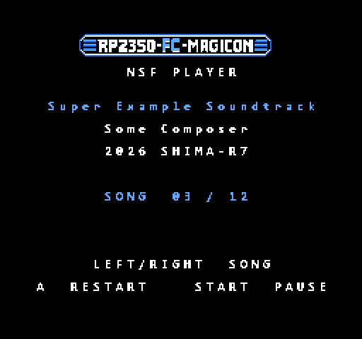

# FC-MAGICON ファームウェア

pico-sdk 2.3.1、RP2350B(Waveshare Core2350B2)。ボード定義は `boards/fc_magicon.h`
(SDK の `waveshare_core2350b.h` から、UART・I2C・SPI の既定ピンを外したもの。GPIO0/1 などはバスに使っているため)。

## ビルド

```
pwsh -File build.ps1
```

- 道具は `C:\Users\Yugo\pico` に置いてある(2026-09-26 に GitHub の公式リリースから取得):
  xPack arm-none-eabi-gcc 15.2.1、CMake 4.4.3、Ninja 1.13.2、pico-sdk 2.3.1 + TinyUSB、picotool / pioasm 2.3.1。
- パスに日本語が入るとビルドできないので、`C:\Users\Yugo\pico\work\fc-magicon` にコピーしてからビルドする。
- できた `.uf2` は `out/` に入る。

## 書き込み

1. Core2350B を USB(FPC アダプター)で PC につなぐ。
2. 基板の **BOOTSEL** を押したまま **RESET** を押して離す → PC に「RP2350」ドライブが出る。
3. `out/bus_test.uf2` をそのドライブにコピーする。

## bus_test(基板が届いて最初に試す)

CPU バスの読み出し・書き込みが正しく動くかを確かめる。PPU 側(CHR)はまだ返さない(画面は出ない)。

| 動作 | 内容 |
|---|---|
| 起動直後 | バスのピンをすべて入力(プル無し)にする。本体の 5V(GPIO46)が来るまで、LED が速く点滅し、USB シリアルに `waiting for Famicom 5V` を出す |
| 本体の電源が入ったら | 250MHz で動かし、$8000-$FFFF にテスト ROM(16KB、`gen_test_rom.py`)を返す |
| テスト ROM | 矩形波 1ch で約 440Hz を鳴らし続け、ループのたびに $8000 へ書き込む |
| RP2350B | その書き込みを数え、65536 回ごとに LED を反転(約 0.5 秒ごと)。USB シリアルに毎秒の読み出し・書き込みの回数を出す |

### 立ち上げの手順

1. **モジュールを載せる前に**、テスターで +5V(J4 の 30/60 列など)と GND の間がショートしていないか確かめる。
2. モジュールを載せ、**本体に挿さずに** USB だけつなぐ。LED が速く点滅し、シリアルに `waiting for Famicom 5V` が出れば、
   RP2350B は動いていて、バスには何も出力していない。
3. 本体の電源を切った状態で挿し、電源を入れる。
   - **ピーという音が出て、LED が約 0.5 秒ごとに点滅**すれば、CPU バスの読み出しと書き込みが動いている。
   - シリアルの `writes/s` はおよそ 12 万(1 ループ 15 サイクル、CPU 1.79MHz)。
   - 音が出ない時は、本体のリセットボタンを押す(RP2350B の起動が本体の CPU に間に合わなかった可能性)。
4. うまくいかない時は、TP3(M2)・TP4(/ROMSEL)をオシロで見て、/ROMSEL が動いているか確かめる。

## chr_test(bus_test が動いたら次に試す)

PPU 側の応答、特に「/RD が下がる直前に AD0〜AD7 から下位アドレスを読む」方式が実機で成り立つかを確かめる。

| 動作 | 内容 |
|---|---|
| CPU 側 | テスト ROM(`gen_chr_rom.py`)がパレットとネームテーブル(0〜255 を繰り返し)を書き、背景を表示し、音を鳴らす |
| PPU 側 | パターンテーブル($0000-$1FFF)の読み出しに、RP2350B が作った CHR を返す。A13 = 1(ネームテーブル)の時は出さない |
| タイル | タイル t は下位2ビットの色で塗り、上辺と左端は色1(白)の線 |
| CIRAM A10 | GPIO43 を Low に固定(JP1 を閉じた時は1画面ミラー)。JP2/JP3 でもよい |

**判定**

- 画面に **4色の縦縞と、8ドットごとの白い格子** が並べば、下位アドレスの読み取りは正しい。
- 模様が崩れる・縞の順番が乱れる時は、読み取るタイミングがずれている。TP1(/RD)と TP2(PPU D0)をオシロで見て、
  /RD が下がってからデータが出るまでの時間と、PPU がデータを取り込むまでの余裕を測る。
- USB シリアルの `ppu chr/s` は、表示中におよそ 500 万前後になる見込み(1 ラインあたりの読み出し × 240 ライン × 60 フレーム)。

## magicon(マジコン本体。bus_test・chr_test が動いたら)

フラッシュに書いた `.nes` をファミコンで動かす。

```
pwsh -File load_rom.ps1 game.nes
```

- Core2350B を USB でつないだまま実行する。magicon が動いていれば picotool が自動で書き込みモードにし、書いた後に再起動する
  (ほかのファームウェアの時は BOOTSEL を押したまま RESET を押して離してから)。書いたらファミコンの電源を入れ直すかリセット。
- ROM はフラッシュの 8MB 目に置く(`tools/nes_pack.py` が「"FCMG" + 長さ + 合計」を前に付ける)。ファームウェアを書き直しても消えない。
- ROM が無い・壊れている・対応していない時は、chr_test と同じ試験画面を出す。USB シリアルに理由を出す。

| 項目 | 内容 |
|---|---|
| マッパー | 0 NROM、1 MMC1、2 UxROM、3 CNROM、4 MMC3、7 AxROM、87 Jaleco J87(ツインビー)、184 Sunsoft-1(アトランチスの謎) |
| 大きさ | PRG + CHR の合計 384KB まで(RP2350 の SRAM に写す)。SMB3(256K + 128K)まで入る。512KB の MMC3 はまだ |
| CHR-RAM | 8KB。CPU の `$2006`/`$2007` への書き込みを横から読んで作る(PPU の /WR ではアドレスが読めないため) |
| WRAM | `$6000-$7FFF` 8KB。**電源を切ると消える**(バッテリーのセーブはまだ) |
| ミラーリング | PIO2 が PPU A10 / A11 を CIRAM A10(GPIO43)へ写す。**JP1 を閉じた時だけ効く**(JP2 / JP3 は固定) |
| MMC3 の IRQ | PPU の読み出しで A12 の立ち上がりを数え、GPIO45 → Q1 で /IRQ を出す |
| USB シリアル | ROM の情報と、1 秒ごとの CPU サイクル(約 179 万)・PPU 読み出し・書き込みの回数 |

CPU バスは bus_test と違い **M2 で起きて全サイクルを拾う**(`magicon/cpu_m2.pio`)。M2 が上がって 80ns 後にアドレスを読み、
書き込みサイクルは M2 が下がった所でデータをもう一度読む。bus_test(/ROMSEL で起きる)が動いて magicon が動かない時は、
この 80ns と、書き込みデータを読む時点を疑う。

### NSF プレイヤー

`.nsf` を書くと NSF プレイヤーとして起動する(`pwsh -File load_rom.ps1 music.nsf`)。



| 項目 | 内容 |
|---|---|
| 操作 | ←→ = 前 / 次の曲、A = 最初から、START = 一時停止 |
| 再生 | VBlank の NMI(約 60.1Hz)ごとに PLAY を呼ぶ。再生間隔が標準と違う NSF はテンポが変わる |
| バンク切り替え | `$5FF8-$5FFF`(4KB × 8)。384KB まで |
| 拡張音源 | **まだ鳴らない**(VRC6・FDS・N163 など。本体の 2A03 の音だけ出る) |
| 未対応 | load が `$8000` より下のバンク無し NSF、FDS 用の `$6000-$DFFF` を RAM にする NSF |

しくみ(ハードウェアの NSF プレイヤーでよく使われる形):

- 曲のデータは `$8000-$FFFF`、ドライバー(6502、`magicon/gen_nsf_driver.py` が作る)は `$5000-$5FFF` に置く。
  どちらも RP2350 の SRAM。`$5000-$5FFF` は本体側に何も無いので、カセットが自由に使える。
- ベクター(`$FFFA-$FFFF`)の読み出しだけ、曲のデータではなくドライバーの番地を返す。
- ドライバーは曲を始める時に APU を黙らせ、RAM と `$6000-$7FFF` を 0 にし、バンクを初期値に戻してから INIT を呼ぶ(NSF の決まり)。
  ドライバーの変数はゼロページではなく `$5F80-` に置く(NSF がゼロページを自由に使うため)。
- `magicon/test_nsf_driver.py` が、6502 エミュレーター(py65)でドライバーを動かして確かめる
  (INIT に渡る曲番号、毎フレームの PLAY、←→・A・START、RAM の初期化、バンク切り替え)。

## PC で試す(sim)

magicon のロジック(`magicon/cart.c`)を PC でビルドし、ファミコンのエミュレーター [agnes](https://github.com/kgabis/agnes)(MIT、`sim/agnes/`)の
カセットとして動かす。CPU の全サイクルと PPU の読み出しを、実機の PIO と同じ形の値にして `cart.c` に渡すので、
**実機のファームウェアと同じコードのロジック**(マッパー、CHR-RAM の横読み、MMC3 の IRQ、NSF プレイヤー)を試せる。
試せないのは PIO のタイミング(ナノ秒単位)だけ。

```
pwsh -File sim/build_sim.ps1                       # Zig(C:\Users\Yugo\pico\zig)でビルド → sim/sim.exe
python sim/run_compare.py game1.nes game2.nes ...    # magicon と agnes 自身のマッパーで動かし、画面を毎フレーム比べる
sim/sim.exe music.nsf --frames 600 --wav --press "200:R:3" --out DIR   # 画面(BMP)と音(WAV)を書く
```

- agnes は音が無いので、`sim/apu.c` で本体の音源(パルス 2・三角・ノイズ。DMC は無し)を作って WAV にする。
- agnes はスプライトの絵を 1 ドットごとに読むので、magicon のモードでは実機と同じ 257〜320 ドット目の読み出しを別に流す
  (MMC3 の A12 の数え方を実機に近づけるため)。`sim/patch_agnes.py` が agnes にこの差し込み口を足す。
- 2026-09-27 の結果(手元で吸い出した 12 本。ROM はリポジトリに入れない):
  マッパー 0/1/2/4 の 8 本は、agnes 自身のマッパーと **1200 フレームすべて画面が一致**(SMB3 の MMC3 の IRQ、DQ2/DQ3 の CHR-RAM を含む)。
  agnes に無いマッパー 3/87/184(グラディウス、テトリス、ツインビー、アトランチスの謎)は magicon だけで動かして、画面を目で確かめた。
- 試験用の NSF(`sim/make_test_nsf.py`、3 曲でバンク切り替えあり)で、NSF の `$5FF8` のバンク切り替えが効いていない抜けが見つかった(直した)。

## 次に作るもの

- NSF の拡張音源(RP2350 で合成して GPIO44 の PWM → 46番へ。VRC6 → FDS → N163 → 5B → MMC5 → VRC7 の順)
- バッテリーバックアップ(WRAM をフラッシュへ保存)
- 512KB を超える ROM(PSRAM)
- 画面転送(FC-PICO 方式)
- USB から ROM を送る(picotool を使わない)

## ファイル

| パス | 内容 |
|---|---|
| `bus_test/` | CPU バスの応答テスト(`cpu_bus.pio`、`gen_test_rom.py` → `test_rom.h`) |
| `chr_test/` | PPU の CHR 応答テスト(`ppu_chr.pio`、`gen_chr_rom.py` → `chr_rom.h`) |
| `magicon/` | マジコン本体(`cart.c` = マッパー・NSF とバスの応答、`cpu_m2.pio`、`mirror.pio`) |
| `magicon/gen_nsf_driver.py` | NSF ドライバー(6502)・画面・フォントとロゴの CHR を作る → `nsf_driver.h` |
| `magicon/test_nsf_driver.py` | NSF ドライバーを 6502 エミュレーターで確かめる(`pip install py65`) |
| `load_rom.ps1`、`tools/nes_pack.py` | .nes をフラッシュの ROM 置き場に書く |
| `tools/asm6502.py` | テスト ROM 用の小さな 6502 アセンブラ(Python の関数で書く、分岐先を計算する) |
| `boards/fc_magicon.h` | ボード定義 |
| `out/*.uf2` | ビルド済みのファームウェア |
